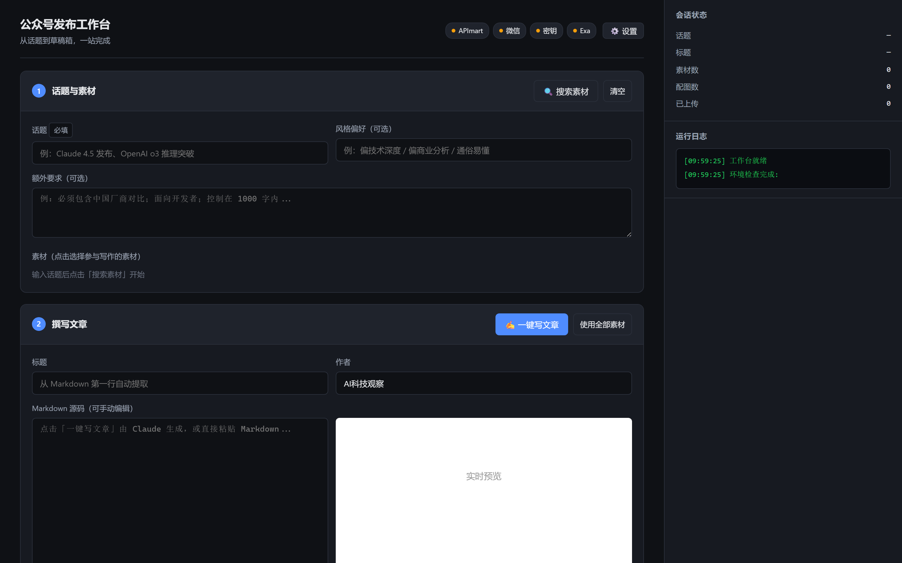
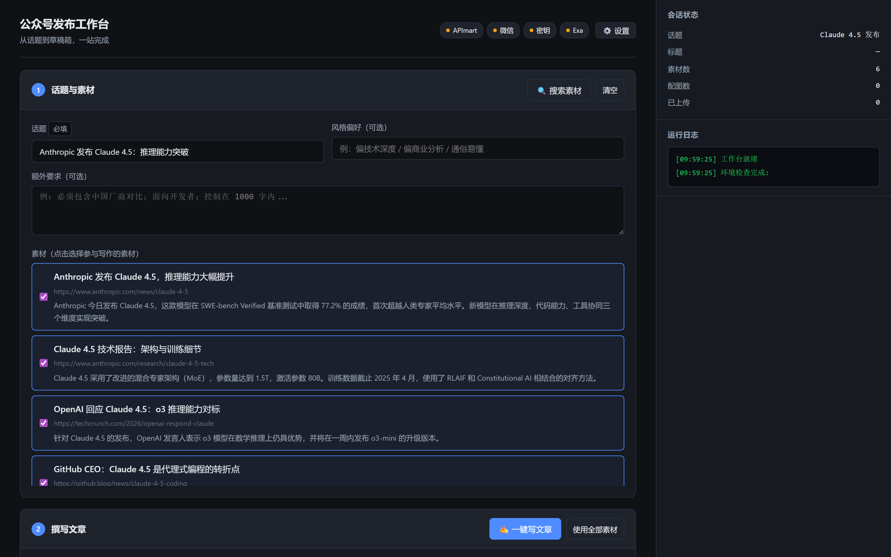
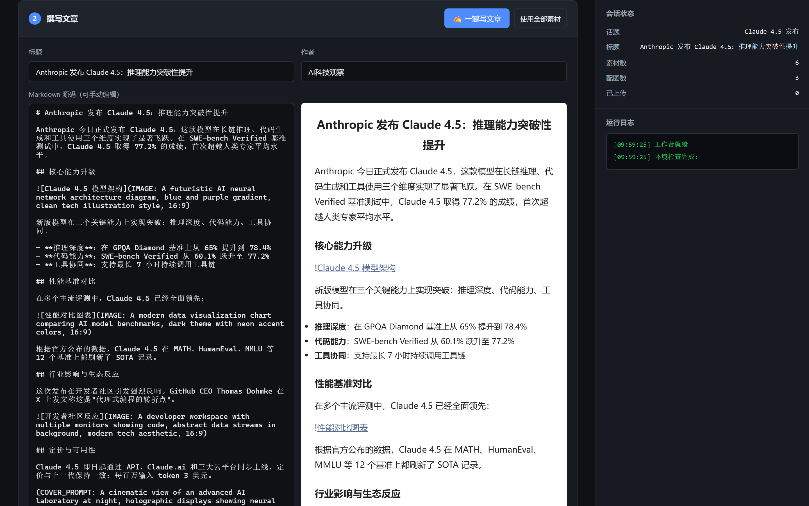
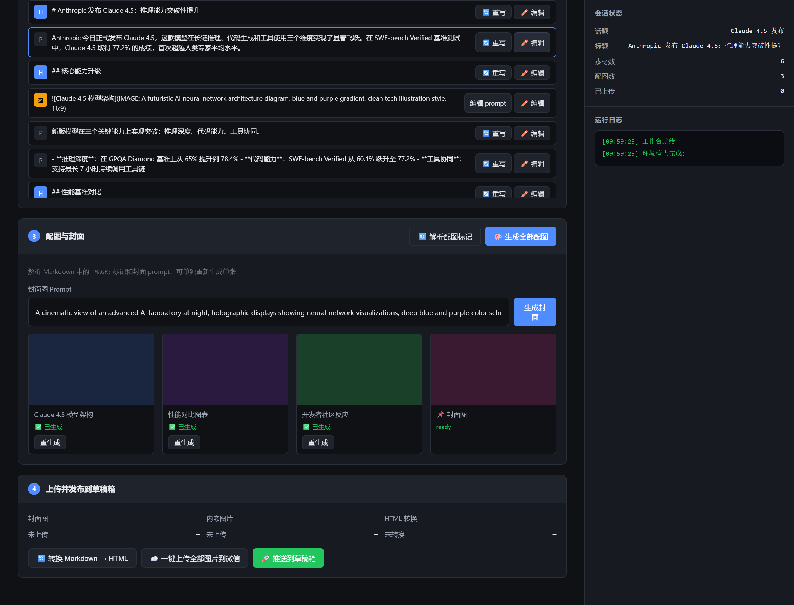
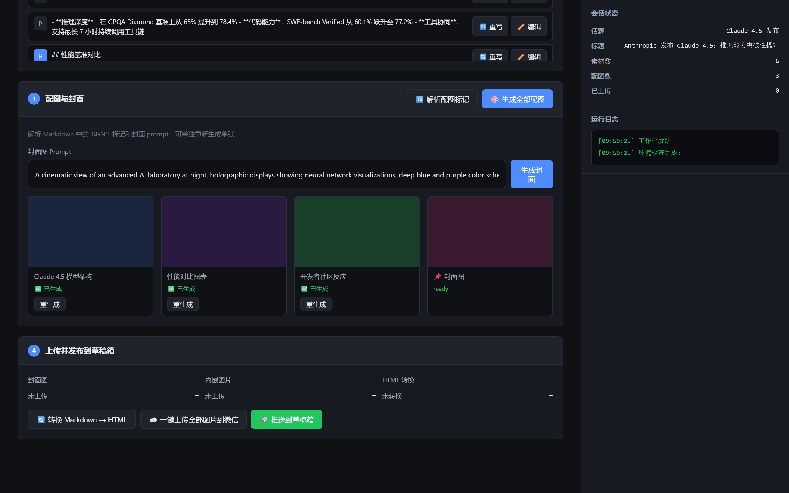
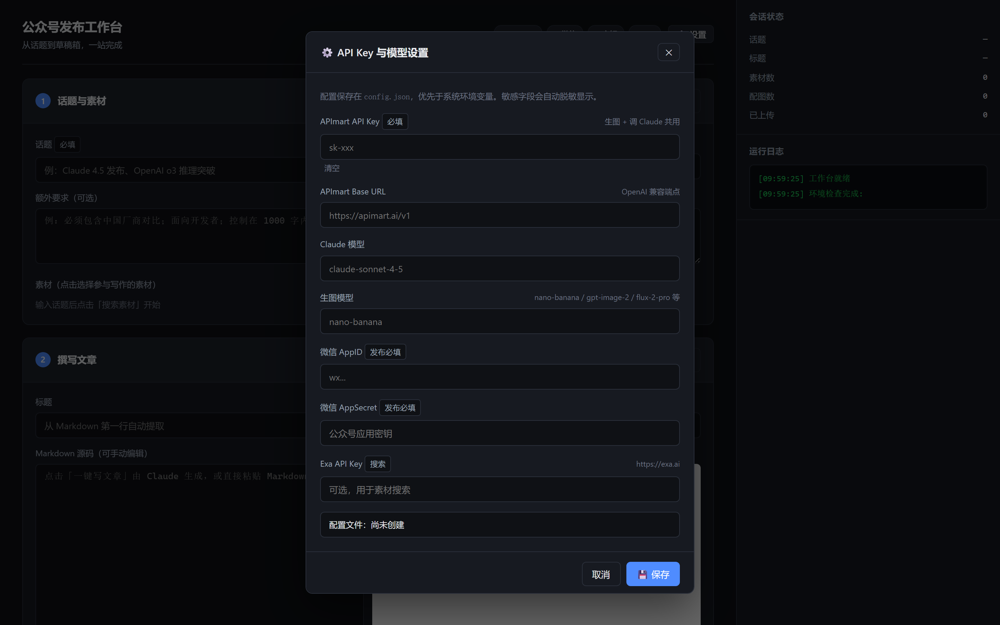
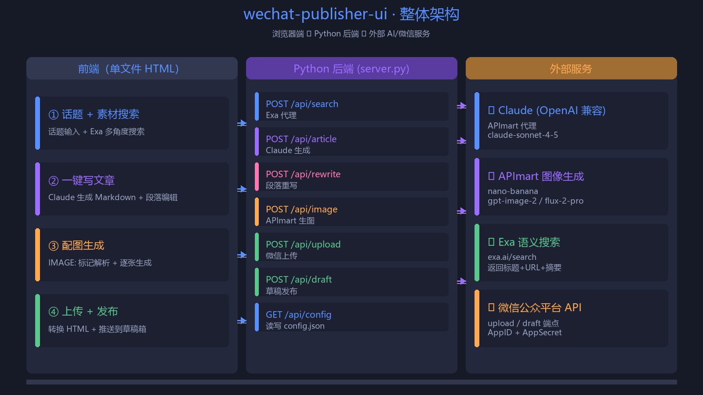
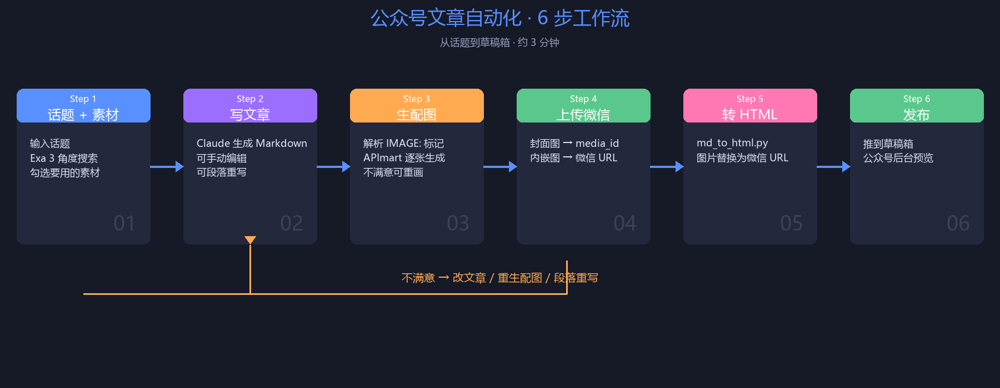

# AI News Publisher · 公众号发布工作台

> 把 AI 写作、图像生成、微信发布这三件事**塞进一个浏览器页面**——从话题输入到公众号草稿箱，3 分钟搞定。



---

## 项目结构

```
ai-news-publisher/
├── index.html           # 可视化 Web UI（单文件前端）
├── server.py            # Python 后端，零依赖
├── start.bat            # Windows 一键启动脚本
├── config.example.json  # 配置模板
├── skill/               # Claude Code Skill（可独立安装到 ~/.claude/skills/）
│   ├── SKILL.md         # Skill manifest
│   ├── README.md        # Skill 说明文档
│   ├── references/
│   │   └── wechat_format.md
│   └── scripts/
│       ├── apimart_image.py   # APImart 图片生成
│       ├── md_to_html.py      # Markdown → 公众号 HTML
│       └── wechat_api.py      # 微信公众号 API
├── docs/images/        # 效果截图 + 架构图
└── scripts/             # 开发辅助脚本（截图 / 架构图）
    ├── screenshot.py
    ├── mocks.py
    └── arch.py
```

---

## 目录

1. [这是什么](#-这是什么)
2. [效果展示](#-效果展示)
3. [整体架构](#-整体架构)
4. [完整工作流](#-完整工作流)
5. [底层的 ai-news-publisher Skill](#-底层的-ai-news-publisher-skill)
6. [快速开始](#-快速开始)
7. [详细使用教程](#-详细使用教程)
8. [API 端点一览](#-api-端点一览)
9. [常见问题](#-常见问题)

---

## 🧩 这是什么

**AI News Publisher** 是一个**二合一项目**：

1. **可视化 Web 工作台**（`index.html` + `server.py`）：把 Claude 写文章、APImart 生图、微信公众号发布三套外部能力用单文件 HTML + Python 标准库后端串成一条流水线。
2. **Claude Code Skill**（`skill/`）：如果你是 Claude Code 用户，也可以不启动 Web，直接在 Claude 里说"写一篇关于 XXX 的公众号文章"，触发底层同一套脚本。

两条路复用同一组 Python 脚本。区别只是入口：浏览器 vs. 对话框。

相比直接用 Skill 跑命令行的方式，它解决这些痛点：

| 痛点 | 解决方案 |
|------|---------|
| API Key 散落在多个环境变量 | 网页里统一管理，自动脱敏，写入 `config.json` |
| 写完文章没法可视化编辑 | Markdown 实时预览 + 段落级重写 / 手动改写 |
| 图片生成后不能单张重画 | 每张图独立卡片，「重生成」一键再来 |
| 不知道跑到哪一步了 | 右侧会话状态 + 实时日志 |
| 命令行复盘很麻烦 | 工作目录的图片、HTML 全部存好随时回看 |

技术栈：

- **后端**：Python 标准库 `http.server` + `subprocess`，零依赖（启动只需系统已装 Python）
- **前端**：单文件 HTML，原生 JS / CSS，零构建
- **AI 能力**：复用现有 `ai-news-publisher` Skill 的脚本（生图 / 转 HTML / 微信 API）
- **新增能力**：搜索、写文章、段落重写由后端直接调 HTTP API

---

## ✨ 效果展示

### 1. 主界面（4 步流水线 + 右侧实时状态）


四步卡片：① 话题 + 素材搜索 → ② 写文章 → ③ 配图生成 → ④ 上传发布。右侧栏实时显示会话状态、运行日志、API Key 状态。

---

### 2. 素材搜索结果（Exa 多角度）



输入话题后，后端代理 Exa API 跑 3-5 次不同角度的搜索（最新动态 / 技术细节 / 行业影响 / 社区讨论），结果以可勾选卡片形式呈现。

---

### 3. 文章编辑 + 实时预览



左侧 Markdown 源码可手动改，右侧实时渲染 HTML 预览。**段落级操作列表在编辑器下方**——



每段独立显示类型图标（H 标题 / P 段落 / 🖼 配图 / 📌 封面 prompt），配 `🔄 重写` 和 `✏️ 编辑` 按钮。点击段落行可跳到编辑器对应位置。

---

### 4. 配图生成 + 单张重画



后端解析 Markdown 中的 `IMAGE:` 标记，调用 APImart 逐张生成。**单张图不满意点「重生成」**，状态、prompt、缩略图都在卡片上一目了然。封面图独立 prompt，独立生成。

---

### 5. 设置面板（API Key 统一管理）



APImart Key / 微信 AppID+Secret / Exa Key / 模型名都在这里。保存后立即生效（无需重启），敏感字段读取时自动脱敏（`sk-****xxxx`）。

---

## 🏗 整体架构



三栏一目了然：

| 栏 | 内容 |
|----|------|
| **前端** | 单文件 HTML，4 步工作流 + 实时状态侧栏 |
| **后端** | `server.py` 暴露 7 个 REST 端点，转发到外部服务 |
| **外部服务** | Claude / APImart / Exa / 微信公众平台 API |

数据流：浏览器 → Python 后端 → 外部服务，配置（API Key、模型名）从 `config.json` 读取并兜底环境变量。

---

## 🔁 完整工作流



6 步流水线，每步独立完成、独立可重做：

| Step | 动作 | 耗时 | 触发重做的入口 |
|------|------|------|---------------|
| 1 | 话题 + 素材 | 5-10s | 改输入重搜 |
| 2 | 写文章 | 20-40s | 一键重写 / 段落重写 / 手动改 |
| 3 | 生配图 | 30-60s/张 | 单张「重生成」 |
| 4 | 上传微信 | 3-5s/张 | 「重新生成失败的」 |
| 5 | 转 HTML | <1s | 重新转换 |
| 6 | 发布草稿 | 1-2s | 改完再推一次 |

橙色反馈回路表示任意一步不满意都可以原路返回修改，无需从头开始。

---

## 🛠 底层的 ai-news-publisher Skill

> 本 UI 复用了 Skill 的 3 个 Python 脚本，搜索 / 写文章 / 段落重写是 UI 端的新增能力。

`skill/` 目录就是 Claude Code Skill 的本体，结构：

```
skill/
├── SKILL.md                 # Skill 的 prompt 描述（告诉 Claude 怎么一步步执行）
├── README.md
├── references/
│   └── wechat_format.md     # 公众号 HTML 排版规范
└── scripts/
    ├── apimart_image.py     # 调 APImart 生图
    ├── md_to_html.py        # Markdown → 微信兼容 HTML
    └── wechat_api.py        # 微信 access_token / upload / draft
```

> 💡 想把 Skill 装到 Claude Code 用户级目录：`cp -r skill/ ~/.claude/skills/ai-news-publisher/`（Windows: `xcopy /E /I skill %USERPROFILE%\.claude\skills\ai-news-publisher\`）。装完后 Claude 可以不通过 Web，直接在对话里说"写一篇关于 XXX 的公众号文章"触发同一套脚本。

### Skill 原本的工作流

| 阶段 | 动作 | 依赖 |
|------|------|------|
| 1. 确认话题 | 询问用户 | — |
| 2. 搜索素材 | Exa MCP 至少 3 个角度 | EXA_API_KEY |
| 3. 写文章 | Claude 生成 Markdown | APIMART_API_KEY |
| 4. 生成配图 | 调 `apimart_image.py` | APIMART_API_KEY |
| 5. 上传微信 | `wechat_api.py upload-cover / upload` | WECHAT_APPID + WECHAT_APPSECRET |
| 6. 转 HTML + 发布 | `md_to_html.py` + `wechat_api.py draft` | 同上 |

### UI 对 Skill 的改动

| 能力 | Skill 原始方式 | UI 改造 |
|------|---------------|---------|
| **搜索** | Claude 通过 Exa MCP 调 | 后端 `POST /api/search` 直接代理 Exa HTTP |
| **写文章** | Claude 自己在对话里写 | 后端 `POST /api/article` 调 Claude API，独立可用 |
| **段落重写** | （Skill 没有） | 新增 `POST /api/rewrite`，按段落级别调 Claude |
| **生图** | subprocess 调 `apimart_image.py` | 保持，UI 加状态显示和单张重画 |
| **上传/转 HTML/发布** | subprocess 调 Skill 脚本 | 保持原样 |

### 复用方式

后端在 `subprocess` 调用时直接传入 Skill 脚本的相对路径：

```python
# server.py
SKILL_DIR = Path(__file__).parent / "skill"
SCRIPTS = SKILL_DIR / "scripts"

subprocess.run([
    sys.executable,
    str(SCRIPTS / "apimart_image.py"),
    "--prompt", prompt,
    "--output", output_path,
], check=True, capture_output=True, text=True)
```

所以**两个入口是协同关系**——Skill 负责能力，UI 负责可视化。修改 Skill 脚本会自动被 UI 复用。

---

## 🚀 快速开始

### 环境要求

- Windows / macOS / Linux
- Python 3.8+（仅用于后端 + 调用 Skill 脚本）
- 任意现代浏览器

### 安装

```bash
# 1. 进入项目
cd wechat-publisher-ui

# 2. (可选) 创建虚拟环境
python -m venv venv
# Windows: venv\Scripts\activate
# macOS/Linux: source venv/bin/activate

# 3. 安装 Playwright（仅用于截图教程，UI 本身不需要）
pip install playwright
playwright install chromium
```

### 配置 API Key

启动后点击右上角 **⚙️ 设置**，填入：

| 字段 | 必填 | 用途 |
|------|------|------|
| **APImart API Key** | ✅ | 生图 + 调 Claude |
| APImart Base URL | ❌ | 默认 `https://apimart.ai/v1` |
| Claude 模型 | ❌ | 默认 `claude-sonnet-4-5` |
| 生图模型 | ❌ | 默认 `nano-banana` |
| **微信 AppID** | 发布时 | 公众号应用 ID |
| **微信 AppSecret** | 发布时 | 公众号应用密钥 |
| **Exa API Key** | 搜索时 | 素材搜索 |

保存后立即生效，配置写入本地 `config.json`（建议加入 `.gitignore`）。

或者用环境变量（适合 CI / 服务化部署）：

```powershell
# Windows PowerShell
$env:APIMART_API_KEY = "sk-xxx"
$env:WECHAT_APPID = "wx..."
$env:WECHAT_APPSECRET = "..."
$env:EXA_API_KEY = "..."

# macOS / Linux
export APIMART_API_KEY=sk-xxx
export WECHAT_APPID=wx...
export WECHAT_APPSECRET=...
export EXA_API_KEY=...
```

> 优先级：`config.json` > 环境变量 > 默认值

### 启动

**Windows**：

```bash
# 双击 start.bat
# 或命令行
start.bat
```

**macOS / Linux**：

```bash
python server.py
```

打开 http://localhost:8765

> 自定义端口：`PORT=9000 python server.py`

---

## 📖 详细使用教程

### Step 1：输入话题并搜索素材

1. 在 **① 话题与素材** 卡片填入话题（必填），如「Claude 4.5 发布」
2. 选填「风格偏好」（偏技术深度 / 偏商业分析 / 通俗易懂）
3. 选填「额外要求」（必须包含中国厂商对比、面向开发者等）
4. 点击 **🔍 搜索素材** 按钮

后端会调用 Exa 跑 3-5 个不同角度的搜索，结果以可勾选卡片呈现，**默认全部勾选**。

### Step 2：写文章 + 编辑

1. 确认素材已勾选，点击 **✨ 一键写文章**
2. 等待 20-40 秒，右侧实时显示 Claude 输出进度
3. 完成后中间编辑区自动填入 Markdown，右侧实时预览 HTML

**修改文章的三种方式**：

- **整体重写**：改输入要求后点「一键写文章」
- **段落重写**：在段落列表找目标段，点 **🔄 重写** → 弹窗填改写要求（如"加一个对比表格"）→ Claude 改写并替换
- **手动改写**：在段落列表点 **✏️ 编辑** → 行内直接改文本 → 点 **💾 保存**

> 段落重写会**自动带上前后段落作为上下文**，改写后语义更连贯。

### Step 3：生成配图

1. 文章里所有 `` 标记会被自动解析成图片列表
2. 在 **③ 配图与封面** 卡片点 **🎨 生成全部配图** → 后端并发（实际是串行）调 APImart 生图
3. 等待生成，单张图不满意 → 点卡片上的 **🔄 重生成**（prompt 可临时改）
4. 封面图：独立输入框填 prompt → 点 **生成封面**

### Step 4：上传 + 发布

1. **转换 Markdown → HTML**：调用 `md_to_html.py`，把本地图片路径替换为微信 URL
2. **一键上传全部图片到微信**：调 `wechat_api.py upload`，逐张拿到 `media_id` 或 `url`
3. **推送到草稿箱**：调 `wechat_api.py draft`，自动用文章第一行作标题

### 反馈回路：任意一步都能回头

| 不满意 | 怎么做 |
|--------|--------|
| 搜索结果不准 | 改话题 / 风格偏好 / 额外要求后重搜 |
| 整篇文章不对 | 改输入后「一键写文章」（会替换现有） |
| 某段写得不好 | 段落列表点「🔄 重写」 |
| 某段想自己写 | 段落列表点「✏️ 编辑」 |
| 某张图不行 | 卡片「🔄 重生成」（可改 prompt） |
| 整组配图都不行 | 改 prompt 后「🎨 生成全部配图」 |

---

## 🔌 API 端点一览

后端暴露在 `http://localhost:8765/api/*`：

| 方法 | 路径 | 用途 |
|------|------|------|
| GET | `/api/status` | 服务状态 + 环境变量检测 |
| GET | `/api/config` | 读 `config.json`（敏感字段脱敏） |
| POST | `/api/config` | 写 `config.json` |
| POST | `/api/search` | Exa 多角度搜索 |
| POST | `/api/article` | Claude 生成 Markdown 文章 |
| POST | `/api/rewrite` | 段落级重写 |
| POST | `/api/image` | APImart 生图 |
| GET | `/workspace/image?name=xxx` | 读取工作目录图片（前端 `` 用） |
| POST | `/api/upload` | 上传图片到微信 |
| POST | `/api/convert` | Markdown → HTML |
| POST | `/api/draft` | 推送到公众号草稿箱 |

所有端点接受 JSON `application/json`，错误统一返回 `{"ok": false, "error": "..."}`。

---

## ❓ 常见问题

### 启动相关

**Q: 端口被占用？**
A: 设置 `PORT=9000 python server.py`

**Q: 浏览器自动打开了但页面空白？**
A: 检查 Python 后端控制台是否有报错；或浏览器按 F12 看 Console。

### API Key 相关

**Q: 找不到 APImart 的 API Key？**
A: 登录 [apimart.ai](https://apimart.ai) → 控制台 → API Keys。新注册一般有免费额度。

**Q: 微信公众号 IP 白名单怎么加？**
A: 公众号后台 → 开发 → 基本配置 → 公众号开发信息 → IP 白名单 → 添加本机公网 IP。

### 写文章相关

**Q: 文章生成到一半卡住？**
A: 看右侧运行日志。如果是 Claude 调用超时，等 1 分钟再试；如果是网络问题检查代理。

**Q: Claude 输出的不是中文？**
A: 在「额外要求」里明确写「必须中文输出」。

### 生图相关

**Q: 生图很慢？**
A: APImart 单张图通常 10-30s。如果持续 >1min，模型可能太重，换 `nano-banana` 或 `flux-2-pro`。

**Q: 生图失败重试？**
A: 单张点卡片「重生成」；整组点「重新生成失败的」（自动跳过已成功的）。

### 微信发布相关

**Q: 推送后草稿箱看不到？**
A: 登录 [mp.weixin.qq.com](https://mp.weixin.qq.com) → 草稿箱 → 注意要切换到对应的公众号。

**Q: 提示 `40001 invalid credential`？**
A: AppID / AppSecret 错误或 access_token 失效。检查设置面板填的值。

**Q: 提示 `40164 invalid ip`？**
A: 本机 IP 不在白名单，按上面「API Key 相关」的指引添加。

### 进阶

**Q: 能不能加定时任务自动发？**
A: 当前版本是手动触发。自动发布可以基于 `server.py` 的 API 自己包一层 cron。

**Q: 能不能换其他大模型？**
A: 把 `APIMART_BASE_URL` 改成其他 OpenAI 兼容服务的地址即可，模型名同步改。

---

## 📁 项目结构

```
wechat-publisher-ui/
├── server.py                # 后端（Python 标准库，零依赖）
├── index.html               # 前端（单文件，零依赖）
├── start.bat                # Windows 启动脚本
├── config.json              # API Key 配置（自动创建，建议加 .gitignore）
├── .gitignore
├── docs/
│   └── images/              # 教程截图 + 架构图
│       ├── 01-main.png
│       ├── 02-search.png
│       ├── 03-article.png
│       ├── 04-images.png
│       ├── 05-settings.png
│       ├── 06-paragraphs.png
│       ├── 07-para-list.png
│       ├── arch.png
│       └── flow.png
└── _screenshot.py           # 用 Playwright 重新生成截图（开发者用）
```

---

## 📜 License

MIT

---

## 🙏 致谢

- 底层能力由 [`ai-news-publisher`](../.claude/skills/ai-news-publisher/) Skill 提供
- 文章由 [Anthropic Claude](https://www.anthropic.com) 生成
- 配图由 [APImart](https://apimart.ai) 生成
- 素材搜索由 [Exa](https://exa.ai) 提供
